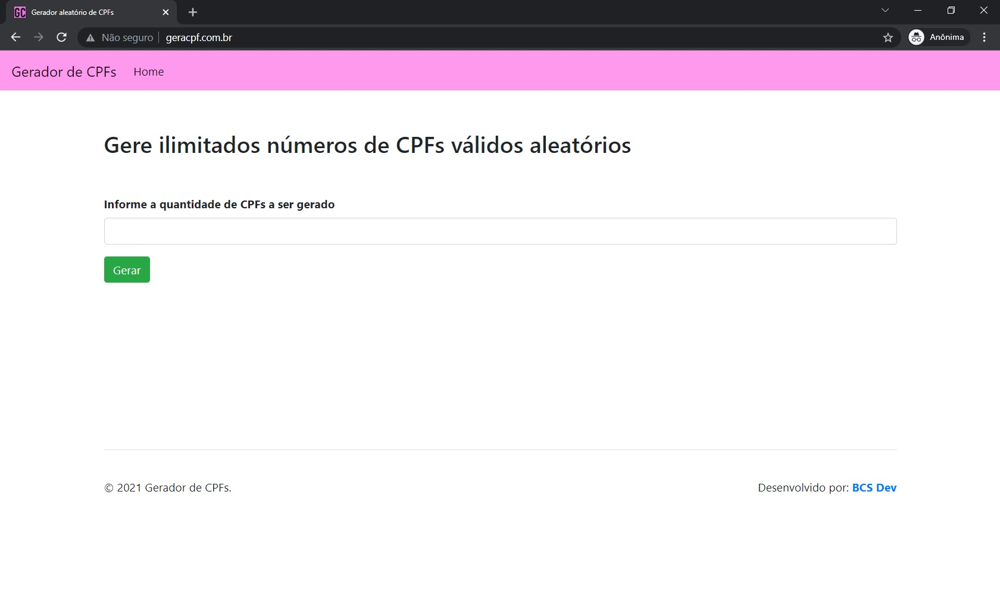
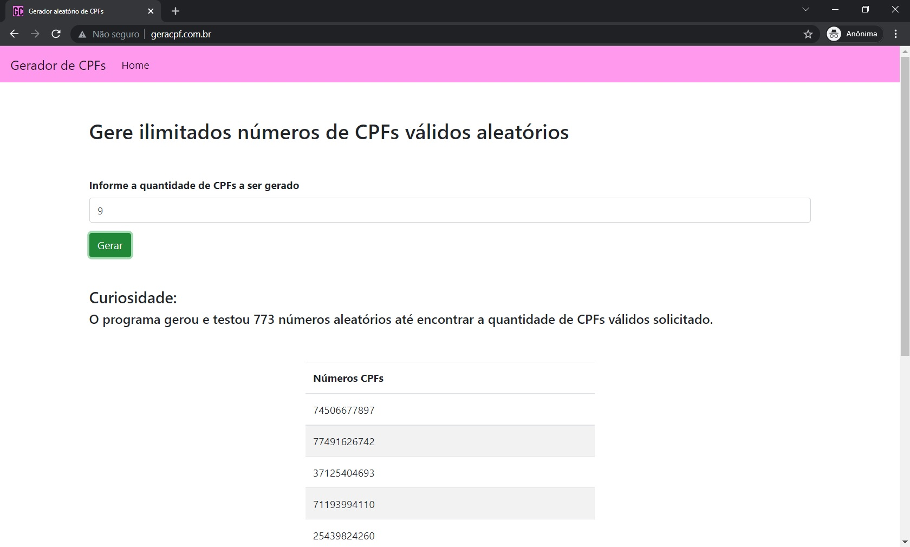

# Gerador-cpf
 Programa simples para gerar CPFs aleatórios válidos
  
  
 Este simplesmente gera números aleatórios de 11 digitos, e testa pata ver se aquele número é um CPF válido. 
 Este processo é executado até que ache o número de CPFs em que o usuário digitou.
   
 <h2>Prints do programa</h2>
 
  
 

